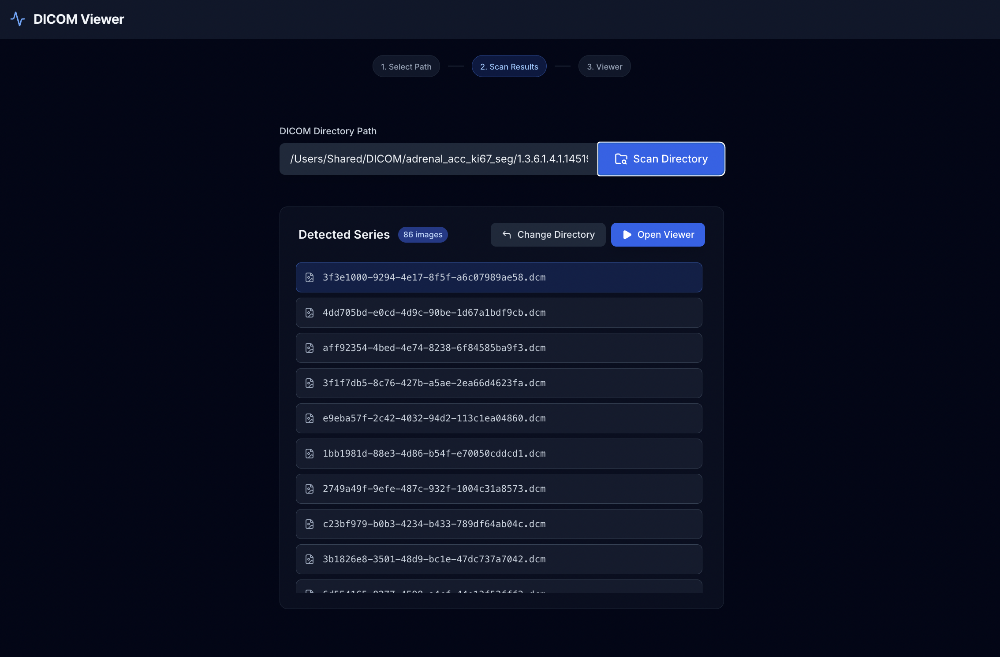
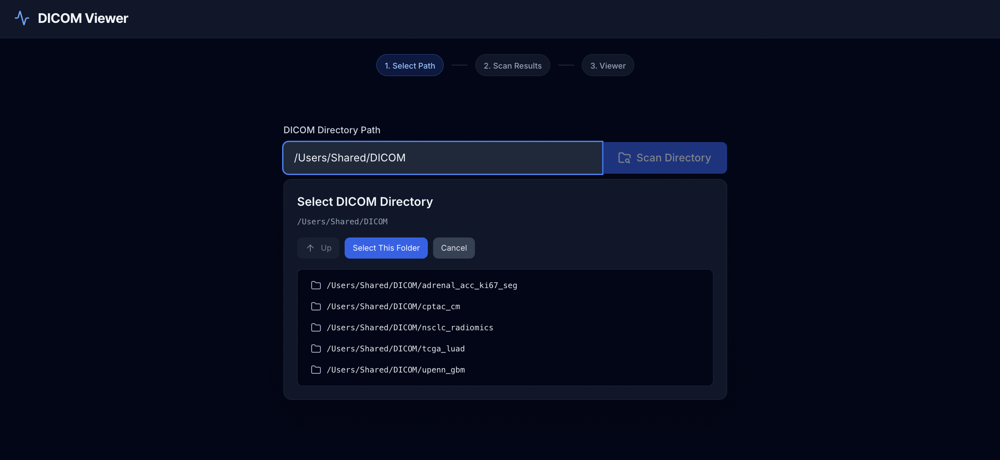
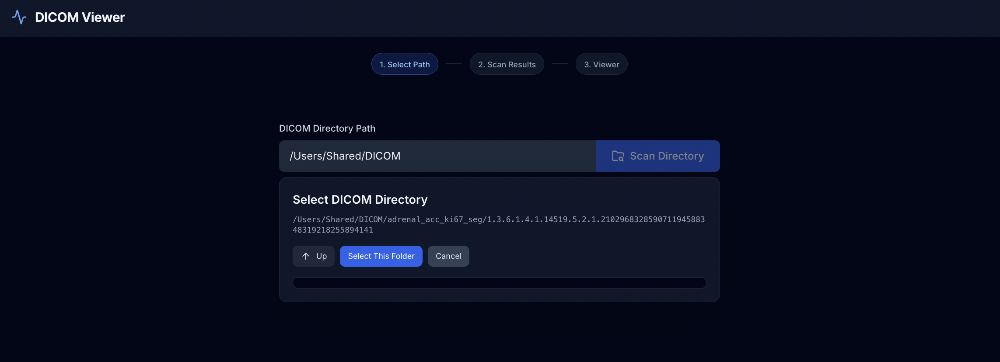
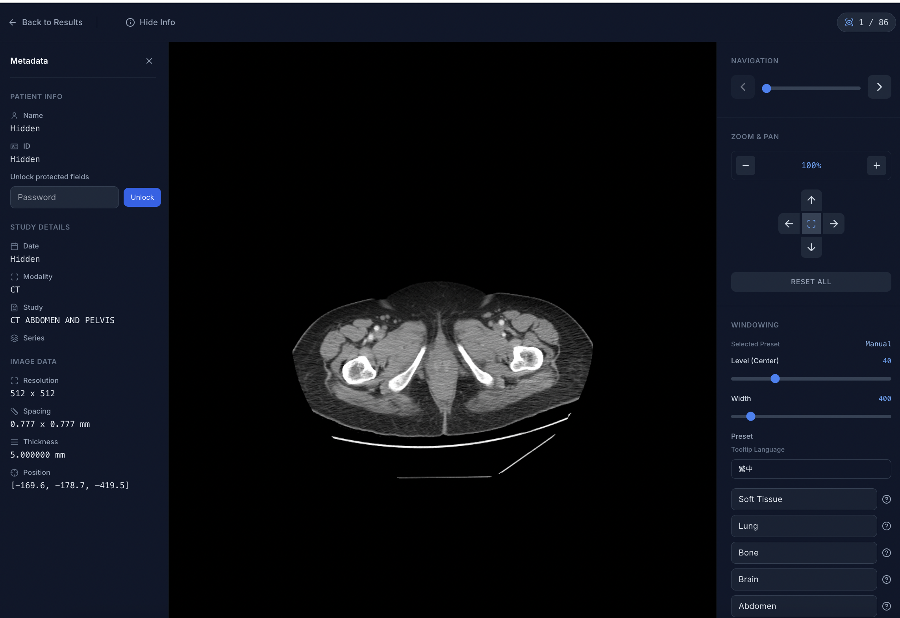
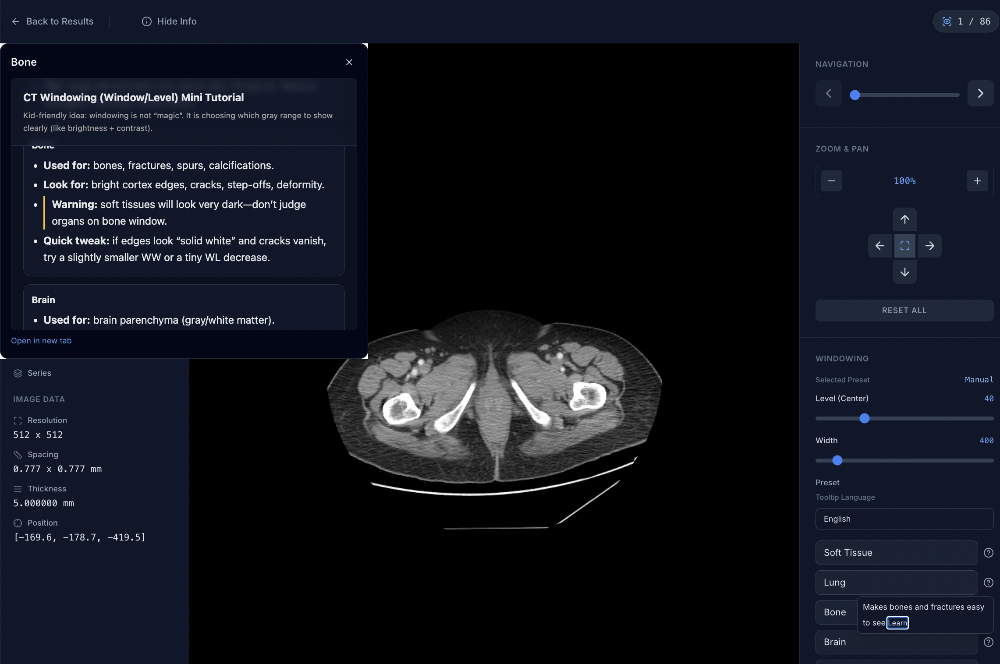
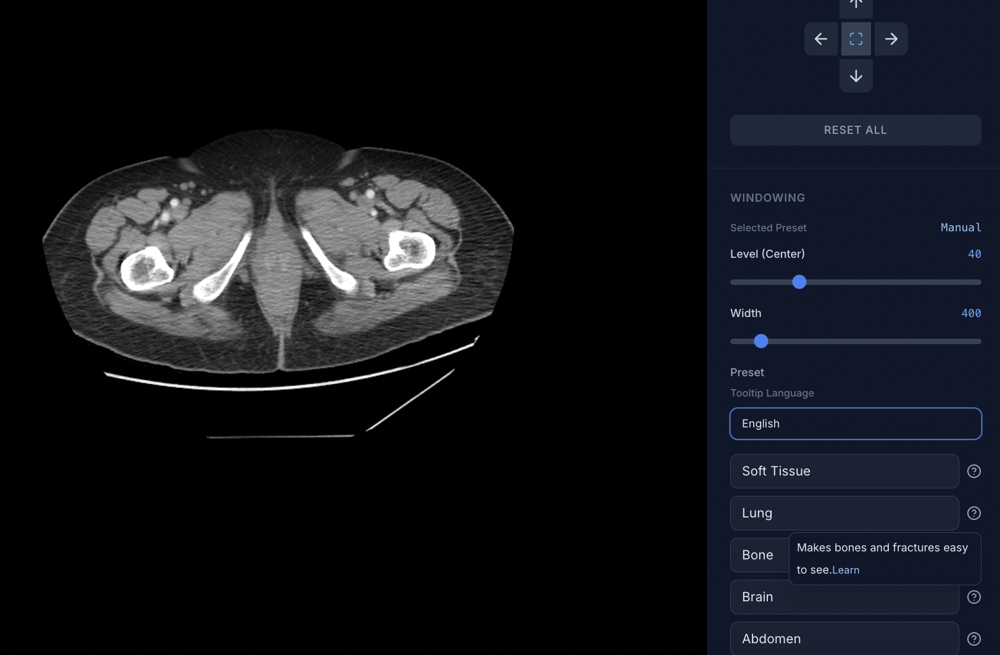

# DICOM Viewer

## Overview

DICOM Viewer is a lightweight image viewer designed for browsing local DICOM folders. It lets you scan and select a DICOM directory, quickly load images into the viewer, and apply common presets to adjust visualization for easier inspection and comparison.

## Usage Guide 

The steps below follow the actual workflow and reference every image under docs/images/ to help you quickly understand and use the product.

### 1) Launch Screen


When you open the app, you will see the initial screen prompting you to choose a DICOM source.

### 2) Scan a DICOM Directory



Click the “scan” or “load” action to start searching for a local DICOM directory.

### 3) Locate the Target Folder



In the file picker, navigate to a folder that contains DICOM files.

### 4) Select the DICOM Folder



Confirm the folder and click “Select”/“Open” to load the images from that directory.

### 5) Open the Viewer



After loading finishes, click the corresponding item to open the viewer.

### 6) Viewer Screen



The viewer provides image browsing and common presets for different visualization settings.

### 7) Preset Tooltip



Hover over a preset button to see its tooltip and learn what each preset does.


## Getting Started

This project is managed with [Poetry](https://python-poetry.org/).

### Prerequisites

- Python 3.11.x
- Poetry


### Installation

1. Ensure Poetry uses Python 3.11:

```bash
poetry env use python3.11
poetry env info
```

2. Install dependencies:

```bash
poetry install
```

### Running the App

Start the development server:

```bash
poetry run ./reflex_rerun.sh
```

The application will be available at `http://localhost:3000`.
